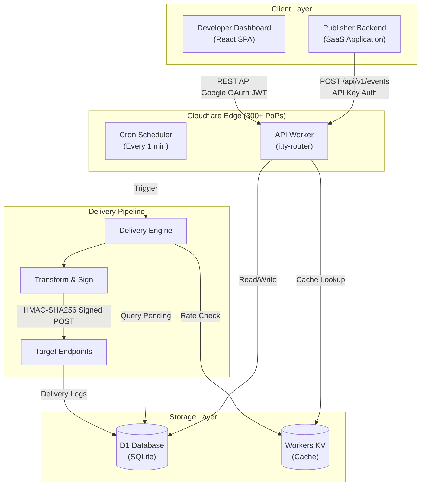
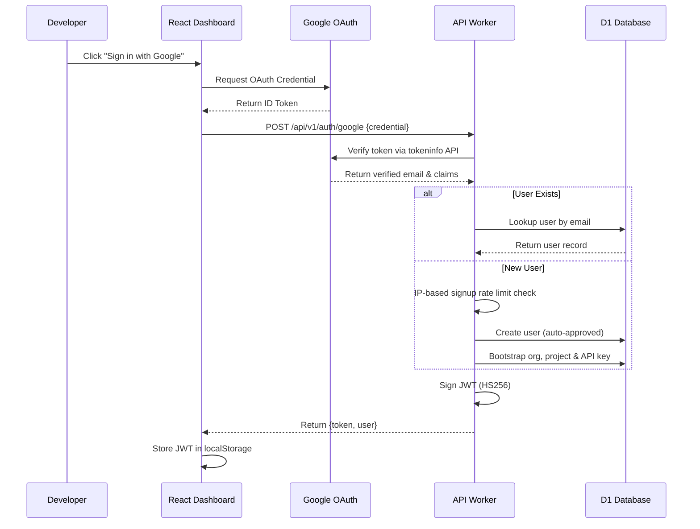
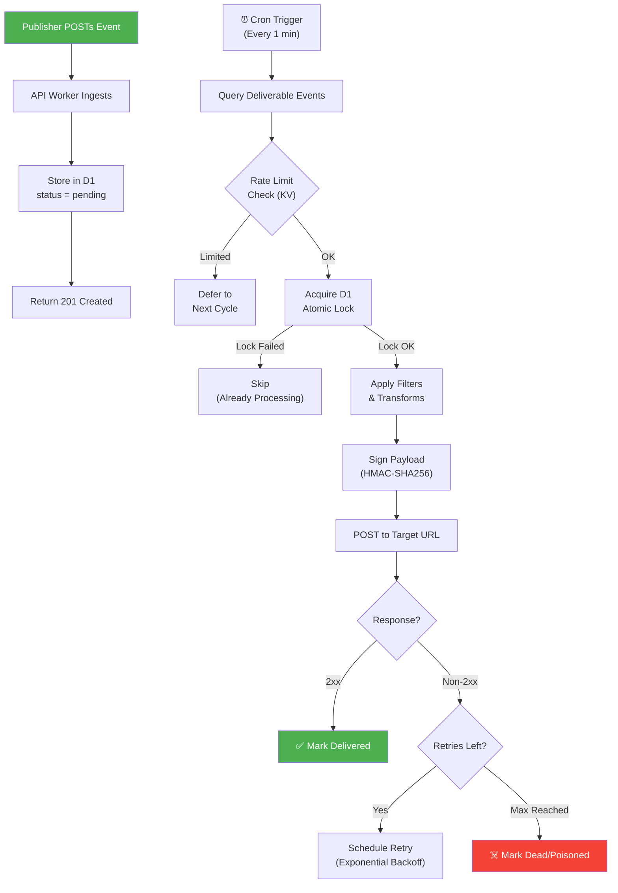
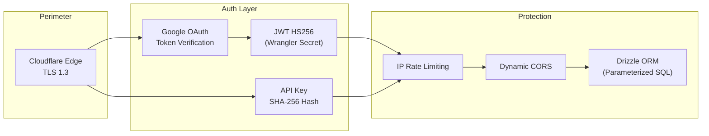

# ⚡ WebHook Hub

> **Enterprise-grade, edge-first, open-source Webhooks-as-a-Service (WaaS) platform.**

WebHook Hub provides developers and SaaS platforms with a highly scalable, reliable, and cost-effective event delivery pipeline — built entirely on Cloudflare's serverless stack with **zero cold starts** and **zero infrastructure management**.

[](https://webhook-platform.masir-projects.me)
[](https://webhook-platform-api.masir-projects.workers.dev/api/v1/docs)

---

## 🏗️ High-Level Architecture



---

## ✨ Core Features

| Feature | Description |
| :--- | :--- |
| **Edge-Native Ingestion** | Built on Cloudflare Workers for sub-millisecond event ingestion with zero cold starts |
| **Resilient Retry Pipeline** | Exponential backoff (`60s → 300s → 900s → 3600s`) with **Poison Event Isolation** |
| **Zero-Downtime Secret Rotation** | Rolling webhook secrets (`current` + `previous`) for safe, uninterrupted rotations |
| **Payload Transformations** | In-transit JSON modifications (rename, remove, insert, template nesting) and event type filters |
| **D1 Distributed Locks** | Atomic SQLite-based concurrency control preventing double-delivery |
| **Multi-Tenant Isolation** | Strict logical isolation using SHA-256 hashed API Keys and JWT HS256 tokens |
| **Google OAuth SSO** | Passwordless authentication via Google Sign-In — no email/password attack surface |
| **IP-Based Rate Limiting** | Brute-force protection on auth routes (5 req/min) and global API rate limiting (60 req/min) |
| **Dynamic CORS** | Origin whitelisting for dashboard APIs; wildcard only for public event ingestion |
| **RBAC & Team Management** | Role-based access control with `owner`, `admin`, and `member` roles per organization |
| **Developer Portal** | Full React dashboard for endpoints, deliveries, audit logs, metrics, and team management |

---

## 🔐 Authentication Flow

WebHook Hub uses **passwordless Google OAuth** for all dashboard user authentication. No passwords are stored or transmitted.



---

## 🔄 Webhook Delivery Pipeline



---

## 📁 Project Structure

```
webhook-platform/
├── apps/
│   ├── api-worker/          # Cloudflare Worker — REST API, jobs, middleware
│   │   ├── src/
│   │   │   ├── routes/      # Auth, webhooks, events, deliveries, admin, docs
│   │   │   ├── services/    # Delivery, rate-limit, transform, version, workspace
│   │   │   ├── middleware/  # JWT & API Key authentication
│   │   │   ├── jobs/        # Scheduled delivery & retention cron jobs
│   │   │   └── db/          # Drizzle ORM schema & migrations
│   │   └── wrangler.jsonc   # Worker configuration
│   └── dashboard/           # React SPA — Vite + React Router
│       ├── src/
│       │   ├── pages/       # Landing, Login, Dashboard, Settings, etc.
│       │   ├── layouts/     # Main layout with header & sidebar
│       │   └── lib/         # API client, auth context, utilities
│       └── index.html       # Entry point with OG metadata
├── docs/                    # Comprehensive technical documentation
├── terraform/               # IaC for Cloudflare resource provisioning
└── README.md
```

---

## 🚀 Quick Start

### Prerequisites

- **Node.js** v18+
- **Git**
- **Wrangler CLI** (`npm install -g wrangler`)

### 1. Clone & Install

```bash
git clone https://github.com/MasirJafri1/webhook-platform.git
cd webhook-platform

# Backend
cd apps/api-worker && npm install

# Frontend
cd ../dashboard && npm install
```

### 2. Initialize Local Database

```bash
cd apps/api-worker
npx wrangler d1 migrations apply webhook-platform-db --local
```

### 3. Launch Dev Servers

```bash
# Terminal 1: API Worker
cd apps/api-worker
npm run dev
# → http://localhost:8787

# Terminal 2: Dashboard
cd apps/dashboard
npm run dev
# → http://localhost:5173
```

### 4. Sign In

Open **http://localhost:5173** and click **"Sign in with Google"**. The platform auto-provisions your workspace (organization, project, and API key) on first login.

---

## 🔒 Security Hardening

WebHook Hub implements defense-in-depth security:

| Layer | Implementation |
| :--- | :--- |
| **Authentication** | Passwordless Google OAuth SSO — zero password attack surface |
| **JWT Signing** | HS256 with secret stored in Cloudflare Wrangler Secrets (never in code/env files) |
| **API Keys** | SHA-256 hashed at rest — plaintext never stored in D1 |
| **CORS** | Dynamic origin whitelisting for dashboard APIs; wildcard only for `/api/v1/events` |
| **Rate Limiting** | IP-based: 5 req/min on auth, 60 req/min global, per-endpoint egress throttling |
| **Signup Protection** | 5 new accounts per IP per 3 hours |
| **Transport** | HTTPS/TLS 1.3 enforced via Cloudflare Edge |
| **SQL Injection** | Parameterized queries via Drizzle ORM |
| **Replay Protection** | HMAC signature timestamps with drift detection + idempotency keys |
| **Circuit Breaker** | Auto-disable endpoints after 20 consecutive delivery failures |



---

## 📖 Documentation

WebHook Hub includes comprehensive technical documentation covering every aspect of the platform:

### Introduction & Core Concepts

- [Platform Overview](docs/introduction/overview.md) — Feature sets, value propositions, and comparative benefits
- [System Architecture](docs/introduction/architecture.md) — Edge-first topology, core layers, and storage design
- [Core Concepts](docs/introduction/concepts.md) — Domain vocabulary: publishers, events, deliveries, retries

### Getting Started

- [Quick Start Guide](docs/getting-started/quickstart.md) — End-to-end local setup with Google OAuth
- [Local Development](docs/getting-started/local-development.md) — Mock files, seeding, and local testing
- [Deployment Manual](docs/getting-started/deployment.md) — CI/CD and manual Cloudflare deployment
- [Infrastructure as Code](docs/getting-started/terraform.md) — Terraform configuration for Cloudflare resources

### API Reference

- [Authentication](docs/api/authentication.md) — Google OAuth, API Key validation, and JWT sessions
- [Webhooks API](docs/api/webhooks.md) — CRUD for webhook endpoint targets
- [Events API](docs/api/events.md) — Event publishing and querying
- [Deliveries API](docs/api/deliveries.md) — Delivery attempt history and logs
- [Metrics API](docs/api/metrics.md) — Live latencies, totals, and response status counts
- [Error Responses](docs/api/errors.md) — Standard error formats (400–500)

### Advanced Guides

- [Secret Rotation](docs/guides/secret-rotation.md) — Zero-downtime signing key rotations
- [Retry Policy](docs/guides/retry-policy.md) — Exponential backoff schedule and poison checks
- [Filtering & Transformations](docs/guides/filtering-and-transformations.md) — Event routing and JSON templates

### Security & Isolation

- [Webhook Signatures](docs/security/webhook-signatures.md) — HMAC-SHA256 verification (Node.js, Python, Go)
- [API Key Protection](docs/security/api-keys.md) — Zero-plaintext SHA-256 hash lookups
- [Replay Protection](docs/security/replay-protection.md) — Timestamp drift limits and idempotency
- [Security Model](docs/security/security-model.md) — Multi-tenant isolation, CORS, rate limiting, and OAuth

### Operations & Maintenance

- [Monitoring & Metrics](docs/operations/monitoring.md) — Observability and audit logs
- [Rate Limits](docs/operations/rate-limits.md) — Ingress, egress, and auth rate limiting
- [Data Retention](docs/operations/retention-policy.md) — 7-day storage limits and purging
- [Dead Letter Queue](docs/operations/dead-letter-queue.md) — Quarantining failed/poisoned events
- [Disaster Recovery](docs/operations/disaster-recovery.md) — D1 restoration and failover

### Internal Architecture

- [Delivery Engine](docs/architecture/delivery-engine.md) — Pipeline routing mechanics
- [Retry Engine](docs/architecture/retry-engine.md) — Concurrency handling for delayed retries
- [Concurrency & Locking](docs/architecture/durable-objects.md) — D1-based distributed event locking
- [Database Schema](docs/architecture/database-design.md) — Table representations and indexing
- [Tenancy & Scoping](docs/architecture/tenancy-model.md) — Multi-tenant isolation and OAuth context resolution

---

## 🛠️ Tech Stack

| Layer | Technology |
| :--- | :--- |
| **Runtime** | Cloudflare Workers (V8 Isolates) |
| **Database** | Cloudflare D1 (Distributed SQLite) |
| **Cache** | Cloudflare Workers KV |
| **ORM** | Drizzle ORM |
| **API Router** | itty-router |
| **Frontend** | React + Vite + React Router |
| **Auth** | Google OAuth 2.0 (GSI) + JWT HS256 |
| **IaC** | Terraform (Cloudflare Provider) |
| **CI/CD** | GitHub Actions |

---

## 👤 Author

Built by **Masir Jafri** — Software Engineer specializing in Full-Stack Development, Backend System Design, and Generative AI.

| | |
| :--- | :--- |
| 🌐 **Website** | [masirjafri.in](https://masirjafri.in) |
| 📝 **Blog** | [blog.masirjafri.in](https://blog.masirjafri.in) |
| 💻 **GitHub** | [@MasirJafri1](https://github.com/MasirJafri1) |
| 🔗 **LinkedIn** | [linkedin.com/in/masirjafri](https://linkedin.com/in/masirjafri) |

---

## 📄 License

This project is open-source. See [LICENSE](LICENSE) for details.
