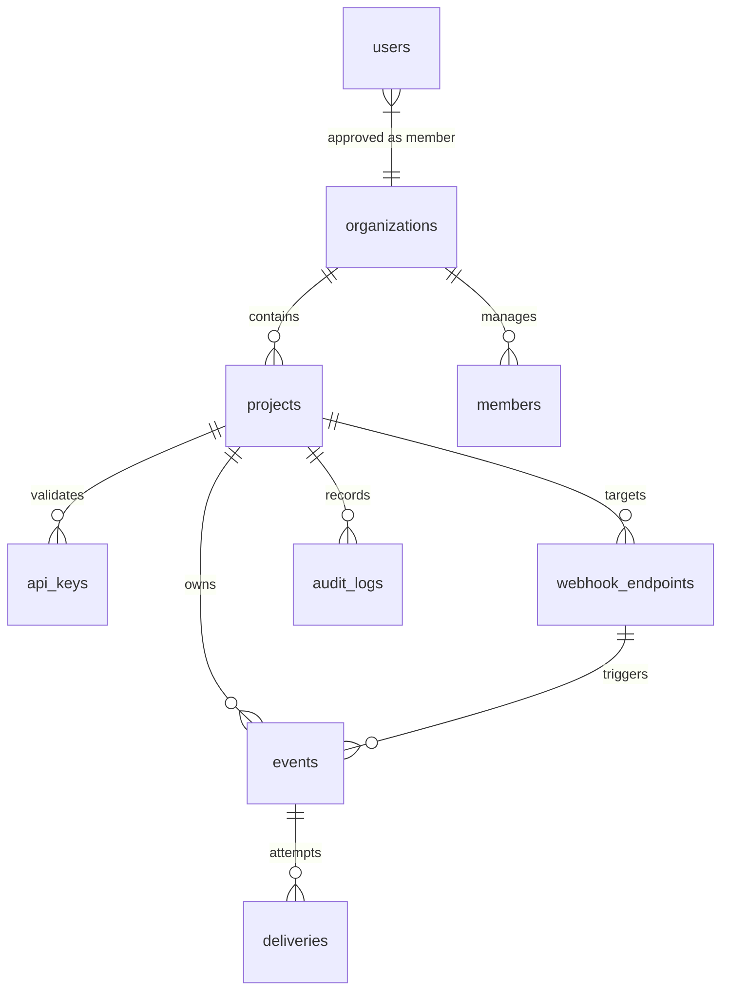

# Database Schema & ERD Design

WebHook Hub uses a relational database schema designed for high-performance edge queries, structural data integrity, and strict multi-tenant isolation. The database layer is managed using Drizzle ORM and compiled to SQLite for Cloudflare D1 deployment.

---

## Entity-Relationship Diagram (ERD)

The diagram below maps the relationships between core system tables:

---

## Table Schemas

### 1. `organizations`
Represents the top-level billing and administrative boundary.
* `id` (text, Primary Key): Unique organization ID (e.g. generated via nanoID).
* `name` (text): Readable name of the organization.
* `created_at` (integer): Unix epoch timestamp of creation.

### 2. `projects`
Represents isolated workspaces. API keys and endpoints are bound to a project.
* `id` (text, Primary Key): Unique project ID.
* `organization_id` (text, Foreign Key): Links to `organizations.id`.
* `name` (text): Project name.
* `monthly_event_limit` (integer, nullable): Maximum allowed events per month.
* `retention_days` (integer): Number of days to keep delivery logs (defaults to 30, capped at 7 by system retention worker).
* `created_at` (integer): Epoch timestamp.

### 3. `api_keys`
API tokens used by publisher servers to authenticate requests.
* `id` (text, Primary Key): Unique key ID.
* `project_id` (text, Foreign Key): Links to `projects.id`.
* `key_hash` (text): SHA-256 hash of the plaintext API key.
* `name` (text): Readable descriptor (e.g., "Production API Key").
* `active` (boolean): Key activation flag.
* `created_at` (integer): Epoch timestamp.

### 4. `users`
Contains dashboard access credentials and verification states.
* `id` (text, Primary Key): User ID.
* `email` (text): User email.
* `password_hash` (text): Salted PBKDF2 hash value.
* `role` (text): Access role (`user` vs `super_admin`).
* `approved` (boolean): Whether the Super Admin approved the user.
* `created_at` (integer): Epoch timestamp.

### 5. `webhook_endpoints`
The target destinations (URLs) where webhook payloads are dispatched.
* `id` (text, Primary Key): Unique endpoint ID.
* `project_id` (text, Foreign Key): Links to `projects.id`.
* `name` (text): Endpoint name.
* `url` (text): Destination HTTP POST URL.
* `current_secret` (text): Current HMAC signing secret.
* `previous_secret` (text, nullable): Rolling secret used before rotation.
* `secret_rotated_at` (integer, nullable): Timestamp of the last rotation.
* `event_filters` (text, nullable): JSON string array of active event triggers.
* `payload_transform` (text, nullable): JSON configuration for key mapping.
* `version` (text): Schema version (defaults to `v1`).
* `active` (boolean): Active state.
* `consecutive_failures` (integer): Increments on delivery failures. If $\ge 20$, the endpoint is disabled (Circuit Breaker).
* `custom_headers` (text, nullable): JSON string mapping of custom headers.
* `requests_per_minute` (integer): Egress throttling cap (defaults to 60).
* `created_at` (integer): Epoch timestamp.
* `deletedAt` (integer, nullable): Soft deletion indicator.

### 6. `events`
Instances of dispatched event triggers.
* `id` (text, Primary Key): Unique event ID.
* `project_id` (text, Foreign Key): Links to `projects.id`.
* `endpoint_id` (text, Foreign Key): Target `webhook_endpoints.id`.
* `event_type` (text): Category name (e.g. `user.signup`).
* `payload` (text): Raw JSON body payload.
* `status` (text): Delivery status state (`pending`, `processing`, `delivered`, `retrying`, `dead`, `poisoned`).
* `retry_count` (integer): Number of failed delivery attempts.
* `next_retry_at` (integer, nullable): Timestamp of the next retry attempt.
* `last_attempt_at` (integer, nullable): Timestamp of the last attempt.
* `idempotency_key` (text, nullable): Key passed by client to prevent duplicate event ingestion.
* `last_error_hash` (text, nullable): SHA-256 hash of the last response error body.
* `poisoned` (boolean): Isolated poison payload indicator.
* `created_at` (integer): Epoch timestamp.

### 7. `deliveries`
Detailed logs of delivery requests and responses.
* `id` (text, Primary Key): Unique attempt ID.
* `event_id` (text, Foreign Key): Links to `events.id`.
* `endpoint_id` (text, Foreign Key): Links to `webhook_endpoints.id`.
* `status` (text): Attempt outcome status (`success` or `failed`).
* `response_code` (integer): HTTP response status code returned by target server.
* `response_body` (text, nullable): Response body returned by target server (truncated).
* `latency_ms` (integer): Execution duration in milliseconds.
* `created_at` (integer): Epoch timestamp.

---

## Indexing Recommendations for SQLite (D1)

To keep query latencies low under SQLite read/write scenarios, the database schema implements these index guidelines:

1. **API Key Lookups**: An index on `api_keys.key_hash` ensures $O(1)$ lookup speeds for incoming API requests.
2. **Scheduled Polling**: A composite index on `events(status, next_retry_at)` allows the delivery background job to instantly retrieve active deliverable items without scanning the entire table.
3. **Multi-Tenancy Filters**: Indexes on `project_id` across `webhook_endpoints`, `events`, and `api_keys` optimize tenant queries.
4. **Idempotency Checks**: An index on `events(project_id, idempotency_key)` speeds up duplicate event checking on ingestion.
