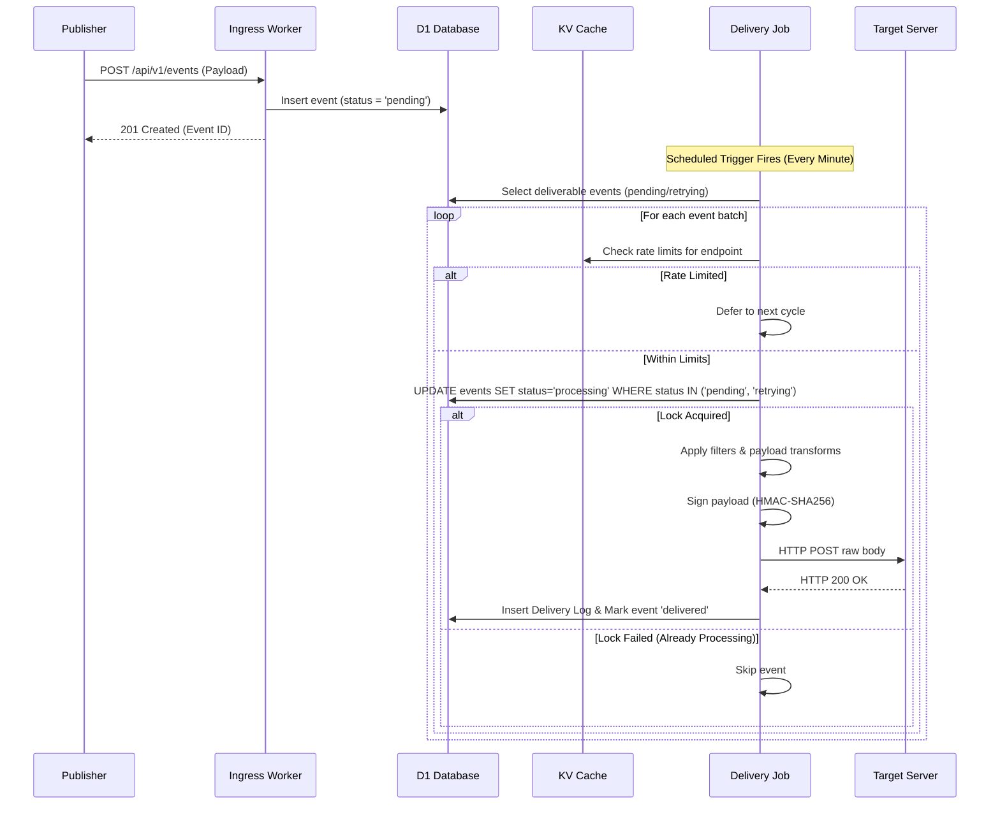

# Event Delivery Engine Architecture

The Event Delivery Engine is the core component of WebHook Hub. It handles incoming event ingestion, filters and transforms payloads, signs requests, and manages reliable egress HTTP dispatches to target URLs.

---

## Egress Architecture Flow

WebHook Hub separates event ingestion from delivery. This decoupling ensures that publishers receive sub-millisecond responses, while delivery execution is run in parallel by background edge workers.

---

## Detailed Pipeline Stages

### Stage 1: Event Ingestion (Ingress)
* **Endpoint**: `POST /api/v1/events`
* **Authentication**: Publisher sends API Key. Middleware verifies hash and extracts the target `projectId`.
* **Idempotency Check**: If an `idempotency-key` is supplied, the database is queried first. If it is a duplicate, the original record is returned without spawning new work.
* **Storage**: The event is written to the D1 database. Status is set to `pending`.

### Stage 2: Scheduled Polling & Batching
* **Trigger**: Cloudflare Cron Trigger executes the entry point `scheduled()` handler.
* **Query**: The job retrieves active, deliverable events from the database:
  * Events with `status = 'pending'`.
  * Events with `status = 'retrying'` where `next_retry_at <= current_timestamp`.

### Stage 3: Filtering & Rate Limits
* **Event Filter Match**: If the endpoint config specifies `eventFilters`, the system checks if the event's type matches. If not, the status is immediately set to `delivered` in D1, and delivery is skipped.
* **Throttling**: The engine checks the KV-based rate limiter. If the target endpoint has exceeded its `requestsPerMinute`, the event is deferred to the next cron cycle.

### Stage 4: Atomic Lock Acquisition
* To prevent race conditions where multiple edge instances attempt to deliver the same event simultaneously:
* The worker executes an atomic database update statement, changing `status` to `processing`.
* Only if the SQLite update returns `changes > 0` does the current execution context proceed with delivery.

### Stage 5: Transformation & Signature
* **Payload Modification**: `TransformService` parses the raw JSON and applies rename, remove, static, and nested path formatting.
* **Versioning**: `VersionService` adapts the payload keys to match version schemas (e.g. `v1`, `v2`).
* **Header Signing**: A high-entropy HMAC-SHA256 signature is calculated over the concatenated string: `${timestamp}.${eventId}.${transformedPayload}`.

### Stage 6: Egress Transmission
* An asynchronous HTTP `fetch` POST is sent to the target URL.
* Timeout limits are enforced to prevent hanging connections.
* Response headers, latency (in ms), status code, and truncated response bodies are captured.

### Stage 7: Status Resolution
* **Success (HTTP 2xx)**:
  * The event status is updated to `delivered`.
  * `consecutiveFailures` for the endpoint is reset to `0`.
* **Failure (Non-2xx / Network timeout)**:
  * The event status is updated to `retrying` (with `next_retry_at` computed) or marked as `dead`/`poisoned`.
  * `consecutiveFailures` for the endpoint is incremented by 1. If this counter reaches 20, the endpoint is set to `active = false` (Circuit Breaker active).
