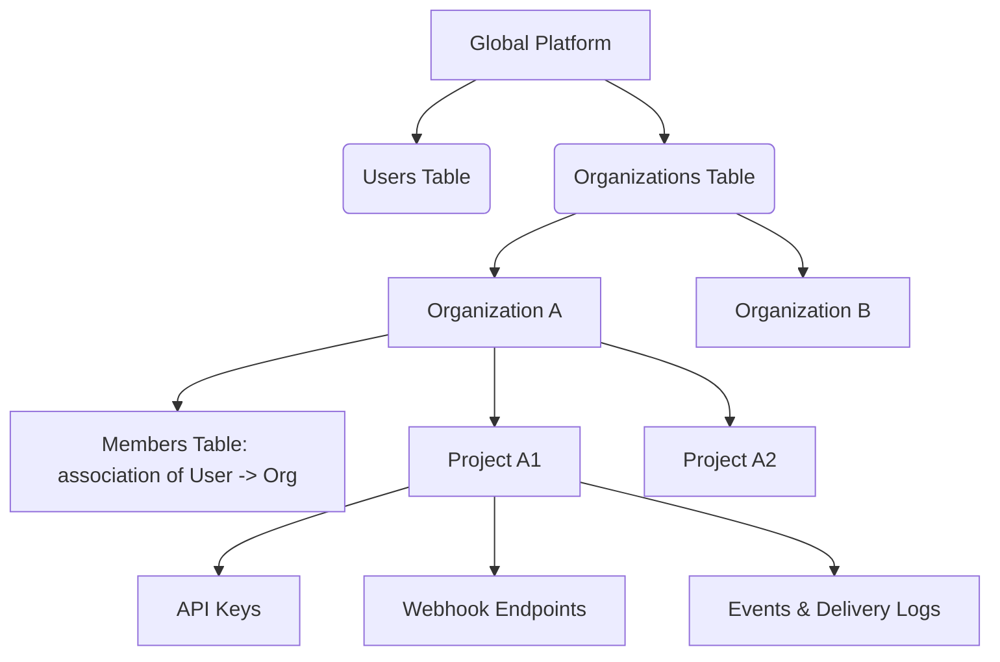

# Tenancy & Workspace Isolation Model

WebHook Hub implements a **multi-tenant logical isolation model** within a shared database instance (sometimes referred to as soft multi-tenancy). This document explains the tenant hierarchy, context resolution during authentication, and how data boundary leaks are prevented at the database layer.

---

## The Tenancy Hierarchy



1. **Organization**: The primary administrative and billing boundary. Users do not own projects directly; they belong to organizations, which in turn hold projects.
2. **Project**: The logical scoping unit for Webhooks. Endpoints, events, and API keys are bound to a specific project. Data is isolated at the Project level.
3. **Members**: Connects users to organizations with specific permission roles.

---

## Dynamic Tenant Context Resolution

When a client makes a REST request, the authentication middleware resolves the tenant context (`projectId`) dynamically on the edge:

### Path A: API Key Request (Publisher Services)
1. The client sends a header: `Authorization: Bearer whpk_live_...`.
2. The authentication middleware hashes the key using SHA-256.
3. It queries the `api_keys` table for the matching hash.
4. If found and active, the middleware extracts the associated `projectId` and attaches it to the request context: `request.projectId = apiKey.projectId`.

### Path B: Session Token Request (Dashboard Users)
1. The browser sends a signed JWT token in the `Authorization` header.
2. The middleware validates the JWT signature using `JWT_SECRET`.
3. It extracts the `userId` and current active `projectId` from the token claims.
4. The middleware validates that the user is an active approved member of the organization associated with that project.
5. The active `projectId` is attached to the request context: `request.projectId = token.projectId`.

---

## Logical Query Isolation (Data Leak Prevention)

To prevent cross-tenant data access (broken object-level authorization), WebHook Hub enforces isolation at the database layer:

* All repository select, update, and delete actions are parameterized and require a `projectId` argument.
* The SQL query filters resources using an explicit `AND project_id = ?` constraint.

### Drizzle Query Isolation Example (`webhook.repository.ts`):
```typescript
async findById(id: string, projectId: string) {
  const rows = await this.db
    .select()
    .from(webhookEndpoints)
    .where(
      and(
        eq(webhookEndpoints.id, id),
        eq(webhookEndpoints.projectId, projectId) // Strict tenant boundary enforcement
      )
    );
  return rows[0];
}
```

Because the `projectId` is resolved during authentication at the edge and passed directly into the repository layer, it is impossible for a user or API key belonging to Project A to read, modify, or delete endpoints belonging to Project B.

---

## Global Admin Access vs. Tenant Access

* **Tenant Users**: Users with standard membership roles have access restricted to projects and organizations that they are members of.
* **Super Admins**: Users flagged with `role = 'super_admin'` bypass standard organization restrictions to perform global operations, such as viewing the pending approval queue (`/api/v1/admin/pending`) and approving new tenant registrations. Super Admins are the only users permitted to write to system configuration tables directly.
