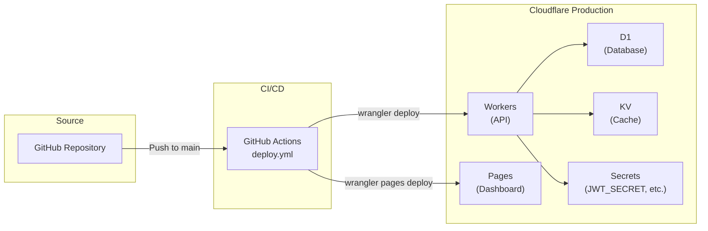
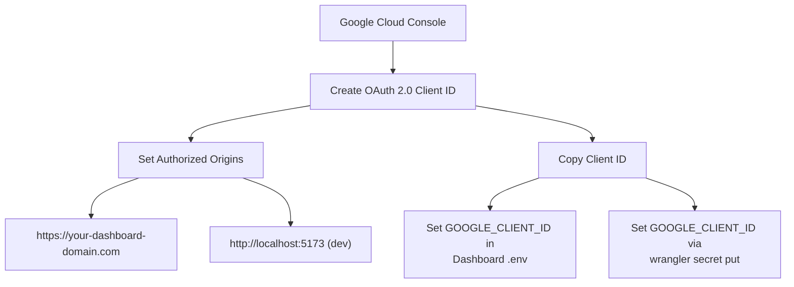

# Production Cloud Deployment Guide

This guide details deploying WebHook Hub into a live Cloudflare production environment using Wrangler CLI or GitHub Actions.

---

## Deployment Architecture



---

## 1. Cloudflare Account Requirements
Before launching, make sure you have:
* A Cloudflare account.
* A registered domain zone mapped to your Cloudflare account (if you intend to use custom domains for webhooks or dashboard).

---

## 2. Deploying via GitHub Actions (CI/CD)
The project comes pre-configured with a Git-triggered automated deployment pipeline inside `.github/workflows/deploy.yml`.

### Configuring GitHub Secrets
Add the following secrets under **Your Repo Settings ➡️ Secrets and variables ➡️ Actions**:
* `CLOUDFLARE_API_TOKEN`: Your Cloudflare API Token with Workers, KV, D1, and Pages Edit permissions.
* `CLOUDFLARE_ACCOUNT_ID`: Your Cloudflare Account ID.
* `PRODUCTION_API_URL`: The deployed Worker API URL (e.g. `https://webhook-platform-api.<subdomain>.workers.dev/api/v1`).
* `CLOUDFLARE_PAGES_PROJECT_NAME`: The name of the project in Cloudflare Pages for your dashboard.
* `VITE_GOOGLE_CLIENT_ID`: The Google Client ID for Google Identity Services OAuth (used by the dashboard build process).

Pushing changes to `main` branch will automatically trigger a clean build, compile, and deploy the entire stack to Cloudflare.

---

## 3. Manual CLI Deployment
If you prefer to deploy directly from your local terminal:

### A. Apply D1 Migrations
Apply your SQL migration configurations to your remote database on Cloudflare D1:
```bash
cd apps/api-worker
npx wrangler d1 migrations apply webhook-platform-db --remote
```

### B. Inject Production Runtime Secrets
Run these commands to bind secure parameters to the worker edge:

```bash
# JWT signing secret (stored in Cloudflare Secrets, never in code)
npx wrangler secret put JWT_SECRET
# Value: <generate a secure random base64 string>

# Google OAuth Client ID for token audience verification
npx wrangler secret put GOOGLE_CLIENT_ID
# Value: <your Google Cloud Console OAuth client ID>

# Set environment to production (disables local test utilities)
npx wrangler secret put ENVIRONMENT
# Value: production
```

> **⚠️ Important**: The `JWT_SECRET` must be a high-entropy, cryptographically random string. Never commit it to source code or `wrangler.jsonc`. Use a generator like:
> ```bash
> node -e "console.log(require('crypto').randomBytes(64).toString('base64'))"
> ```

### C. Seed Production Super Admin

With Google OAuth, users are auto-provisioned on first sign-in. To promote a user to **Super Admin**:

```bash
# After the user has signed in at least once via Google OAuth:
npx wrangler d1 execute webhook-platform-db --remote \
  --command "UPDATE users SET role = 'super_admin' WHERE email = 'admin@yourdomain.com'"
```

---

### D. Deploy Worker
Run the deployment command:
```bash
npx wrangler deploy
```

### E. Deploy Vite Dashboard to Pages
Build the production build and upload it to Cloudflare Pages:
```bash
cd ../dashboard
# Create .env.production containing VITE_API_URL pointing to the worker URL
echo "VITE_API_URL=https://webhook-platform-api.YOUR-SUBDOMAIN.workers.dev/api/v1" > .env.production
npm run build
npx wrangler pages deploy dist --project-name=YOUR-PAGES-PROJECT-NAME
```

---

## 4. Google OAuth Setup (Required)

To enable Google Sign-In in production, you need a Google Cloud Console OAuth 2.0 Client ID:



1. Go to [Google Cloud Console](https://console.cloud.google.com/) → **APIs & Services** → **Credentials**.
2. Create an **OAuth 2.0 Client ID** (Web Application type).
3. Add your dashboard URLs as **Authorized JavaScript origins**:
   - `https://your-dashboard-domain.com` (production)
   - `http://localhost:5173` (local development)
4. Copy the **Client ID** and configure it:
   - **Dashboard**: Set `VITE_GOOGLE_CLIENT_ID` in `.env.production`.
   - **API Worker**: Run `npx wrangler secret put GOOGLE_CLIENT_ID`.

---

## 5. Custom Domains (Recommended)
By default, your worker will be deployed to `<project>.<subdomain>.workers.dev`. For production usage, it is recommended to map your API to a custom subdomain (e.g., `api.webhookhub.com`).
1. Go to your **Cloudflare Dashboard** ➡️ **Workers & Pages** ➡️ Select `webhook-platform-api`.
2. Go to **Settings** ➡️ **Triggers** ➡️ **Custom Domains**.
3. Click **Add Custom Domain** and enter your desired subdomain (e.g. `api.webhookhub.com`). Cloudflare will automatically provision the SSL certificates and configure DNS routing.

---

## 6. Production Security Checklist

- [ ] `JWT_SECRET` set via `wrangler secret put` (not in source code)
- [ ] `GOOGLE_CLIENT_ID` configured in both dashboard and worker
- [ ] `ENVIRONMENT` set to `production` (disables test routes)
- [ ] D1 migrations applied to remote database
- [ ] CORS whitelist updated in `index.ts` with production dashboard URL
- [ ] Super Admin promoted via D1 SQL after first Google OAuth sign-in
- [ ] Custom domain configured with SSL
