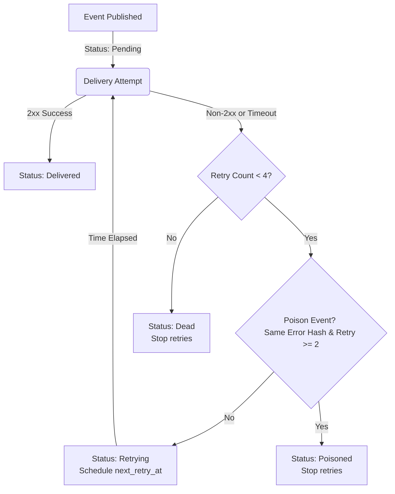

# Retry Policy Guide

In service-to-service communication, network glitches, downstream database locks, and target server restarts are common. WebHook Hub implements a robust, background-scheduled retry policy that guarantees "at least once" event delivery while preventing target servers from being overwhelmed.

---

## The Retry Schedule

When a webhook endpoint returns a non-2xx status code or the request times out, WebHook Hub enters the event into the retry pipeline. The retry engine schedules retries according to a fixed delay array:

| Attempt | Delay After Last Attempt | Cumulative Time Elapsed | Description |
| :--- | :--- | :--- | :--- |
| **0** | *Immediate* | 0 seconds | First delivery attempt. |
| **1** | 60 seconds (1 min) | 1 minute | Quick retry for ephemeral network glitches. |
| **2** | 300 seconds (5 mins) | 6 minutes | Secondary retry to allow short target outages to clear. |
| **3** | 900 seconds (15 mins) | 21 minutes | Tertiary retry for longer backend server restarts. |
| **4** | 3600 seconds (1 hour) | 1 hour, 21 minutes | Final attempt for prolonged downstream downtime. |

After 4 failed retries (5 total attempts), the event is marked as `dead` in the database, halting automatic deliveries.

---

## State Transition Flowchart

The delivery status transitions between the following states:



---

## Poison Event Detection (Circuit Breaker for Payloads)

To prevent wasting compute resources and running into lock loops, WebHook Hub features **Poison Event Detection**.

### How It Works:
1. Every failed delivery computes a SHA-256 hash of the response body or connection error message: `last_error_hash`.
2. On subsequent retry attempts, if the response body hash remains exactly the same (`lastErrorHash === currentErrorHash`) and the retry count is 2 or higher:
   * The event is marked as `poisoned = true` and `status = poisoned`.
   * Further automatic retries are aborted.
3. This signals that the target server is rejecting the payload specifically due to an application-level schema mismatch or validation error rather than a temporary connection issue.

---

## Manual Event Replay

Events that have reached the `dead` or `poisoned` status are not lost. They can be replayed once the target server is back online or the bug has been fixed.

### Replaying a Single Event (REST API)
Send a `POST` request to the replay endpoint:

```http
POST /api/v1/events/:event_id/replay
Authorization: Bearer <your_api_key>
```

**Response (200 OK)**:
```json
{
  "success": true
}
```
*Note: This resets the event's `status` to `pending`, clears the `retry_count` back to `0`, sets `poisoned` to `false`, and triggers immediate delivery in the next background cycle.*

### Bulk Replaying Dead/Poisoned Events
If you experienced an outage that caused multiple webhooks to fail, you can replay all dead and poisoned events for your project:

```http
POST /api/v1/events/replay-all
Authorization: Bearer <your_api_key>
```
