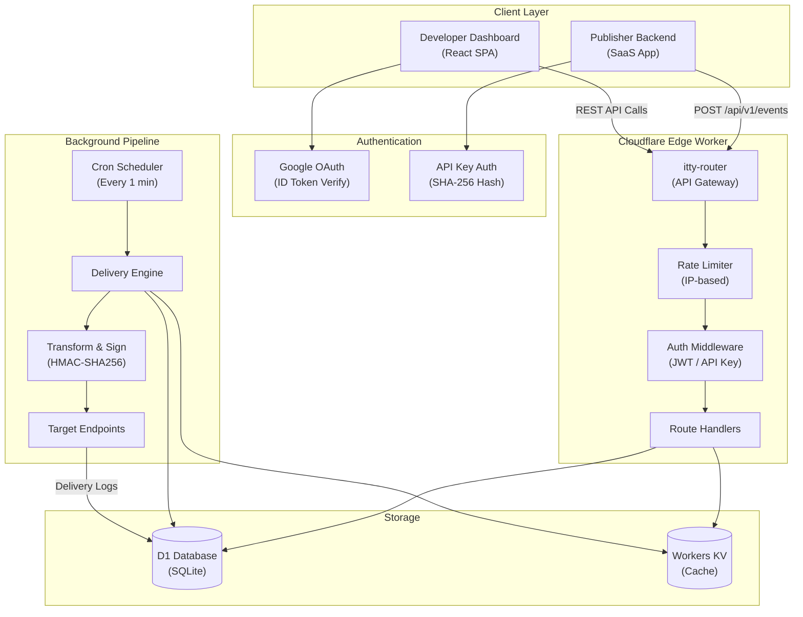
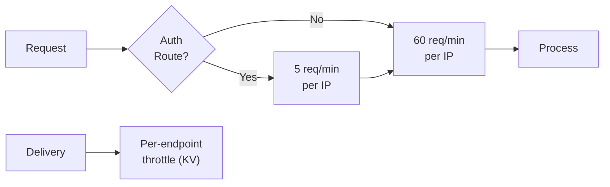

# System Architecture

WebHook Hub is designed from the ground up to leverage Cloudflare's serverless edge computing and database layer.

---

## Edge-First Architecture Topology

The entire application runs at the Cloudflare Edge network across 300+ data centers worldwide. When a client publishes an event, the request is routed to the geographically closest data center, yielding sub-millisecond network times.

---

## Core Layers

### 1. Ingestion & API Gateway (Cloudflare Workers)
The entry point of the application is a stateless worker that routes HTTP requests using the `itty-router` micro-router. 
* **Ingestion Path**: Accepts event payloads, parses them, registers the event to D1, and schedules background delivery in the edge isolate.
* **Management Path**: Handles developer endpoints (CRUD operations for webhooks, keys, search, etc.) secured via JWT session middleware.
* **Authentication Path**: Verifies Google OAuth tokens and issues JWT sessions for dashboard users.

### 2. Multi-Layer Rate Limiting
Rate limiting is enforced at multiple levels to prevent abuse:

* **Auth brute-force**: 5 requests/minute per IP on auth endpoints
* **Global API**: 60 requests/minute per IP on all endpoints
* **Egress**: Configurable per-endpoint rate limit using KV counters

### 3. Distributed Locking & Double Delivery Prevention
To prevent multiple worker threads from processing the same retry or event delivery concurrently:
* A SQLite-based atomic transaction lock is implemented.
* The worker runs a query to update the event status to `"processing"` only if it is currently `"pending"` or `"retrying"`. Since D1 guarantees read-after-write consistency, only one concurrent worker can update the status, preventing double delivery.

### 4. Edge Storage Layer (D1 & KV)
* **Cloudflare D1**: SQL database used as the single source of truth for structural configurations (users, orgs, projects, keys) and transactional logs.
* **Cloudflare KV**: High-performance, distributed key-value store utilized as a cache layer for API key hashes, rate limit counters, and workspaces to skip D1 queries during ingestion cycles.

### 5. Background Processing (`ctx.waitUntil`)
To keep API responses fast, once an event is validated and stored in D1, the API immediately returns `201 Created` to the publisher. The delivery execution is pushed to the edge background thread using `ctx.waitUntil(runDeliveryJob(env))`, ensuring zero latency overhead.

### 6. Dynamic CORS Policy
CORS is enforced with a split strategy:
* **Public ingestion** (`/api/v1/events`): Wildcard `*` origin — any publisher can ingest.
* **Dashboard APIs** (all other routes): Restricted to whitelisted origins (localhost, production domain, Cloudflare Pages previews).
