# Dead Letter Queue (DLQ) & Poison Events

When event delivery fails persistently, it is crucial to quarantine those events. WebHook Hub does not silently drop failed events; instead, it routes them to a virtual **Dead Letter Queue (DLQ)** using database status flags. This allows developers to inspect, debug, and manually replay failed webhooks.

---

## The Two DLQ Statuses

An event is routed to the Dead Letter Queue in one of two states:

```mermaid
stateDiagram-v2
    [*] --> Pending
    Pending --> Attempting
    Attempting --> Delivered : Success (2xx)
    Attempting --> Retrying : Failure (Non-2xx)
    
    state Retrying {
        [*] --> CheckRetryCount
        CheckRetryCount --> Exceeded : Attempt > 4
        CheckRetryCount --> DuplicateError : Same Hash & Attempt >= 2
    }
    
    Exceeded --> Dead
    DuplicateError --> Poisoned
    
    Dead --> [*]
    Poisoned --> [*]
```



### 1. Dead (`status = 'dead'`)
* **Trigger**: The event exhausts the entire retry schedule (all 4 backoff delays: 60s, 5m, 15m, 1h) without receiving a successful `2xx` response.
* **Meaning**: The target server was likely experience a prolonged outage, network routing failures, or server downtime.

### 2. Poisoned (`status = 'poisoned'`)
* **Trigger**: The delivery fails at least 2 times, and the hash of the target server's response body (or error exception text) remains exactly the same as the previous attempt (`lastErrorHash === currentErrorHash`).
* **Meaning**: The request is failing due to an application-level schema mismatch, validation failure, or code bug on the receiver's server. Retrying with exponential backoff will not resolve this; the request will fail indefinitely until code changes are made.

---

## Why Poison Detection Matters

Traditional webhook platforms continue to retry failed events even when the failure is a static validation error (e.g., `400 Bad Request: "missing_field"`). This results in:
1. **Wasted Compute**: Generating and signing payloads repeatedly.
2. **Flooded Logs**: Downstream systems receive redundant error logs, cluttering monitoring platforms.
3. **Database Bloat**: Unnecessary delivery attempt records are generated.

WebHook Hub's Poison Event Detection acts as a circuit breaker for payloads, quarantining the offending event instantly on the second matching failure.

---

## Recovering and Replaying DLQ Events

Once you have identified the source of the issue (e.g., fixing the downstream server's validation code, updating a payload transformation rule, or adjusting custom headers), you can drain the DLQ.

### Replaying a Single Event
Resubmit a specific event to the delivery pipeline:

```http
POST /api/v1/events/:event_id/replay
Authorization: Bearer <your_api_key>
```
* **Effect**: Resets `status = 'pending'`, `retryCount = 0`, `poisoned = false`, and `lastErrorHash = null`. The delivery engine will pick it up on the next background run.

### Bulk Replaying Events
If a target endpoint was down for several hours, you can replay all failed events at once:

```http
POST /api/v1/events/replay-all
Authorization: Bearer <your_api_key>
```
* **Effect**: Resets all events belonging to the project that are currently marked as `dead` or `poisoned` back to the `pending` state.
