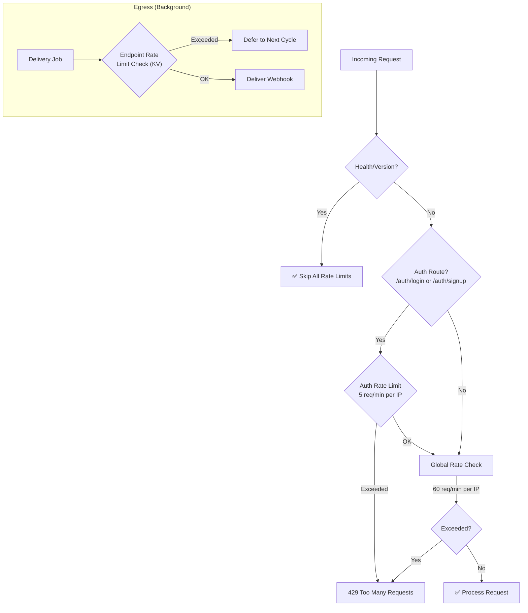

# Rate Limits & Throttling

To prevent resource exhaustion, protect downstream API consumers, and stay within serverless execution bounds, WebHook Hub enforces multi-layered rate limiting on authentication, incoming (ingress), and outgoing (egress) pipelines.

---

## Rate Limiting Overview



---

## 1. Authentication Rate Limiting (Brute-Force Protection)

Dedicated rate limiting protects authentication endpoints from credential stuffing and brute-force attacks.

| Limit | Key Pattern | Threshold | Window | Description |
| :--- | :--- | :--- | :--- | :--- |
| Auth brute-force | `auth:{clientIP}` | 5 requests | 60 seconds | Prevents rapid login/signup attempts |
| Signup throttle | `signup:{clientIP}` | 5 accounts | 3 hours (10800s) | Prevents mass account creation from a single IP |

* **Scope**: Applied to `POST /api/v1/auth/login`, `POST /api/v1/auth/signup`, and `POST /api/v1/auth/google`.
* **Mechanism**: If the IP exceeds the threshold, the API returns `429 Too Many Requests` with a descriptive error message.
* **Implementation**: Uses KV-based counters with TTL-based expiration.

---

## 2. Global API Rate Limiting (Ingress)

A general rate limit applies to **all API endpoints** (except `/health` and `/version`).

* **Default Limit**: 60 requests per minute per IP address.
* **Key Pattern**: `req:{clientIP}`
* **Mechanism**: If a client exceeds the limit, the edge returns a `429 Too Many Requests` HTTP response.
* **Best Practice**: Clients should handle `429` errors by implementing exponential backoff retries when interacting with the API.

---

## 3. Egress Rate Limiting (Target Webhook Protection)

Egress rate limiting is a client-centric feature designed to prevent WebHook Hub from accidentally overloading your customer's backend servers during event spikes (e.g., flash sales, bulk imports, or migrations).

### Configuration
* Every endpoint can define a custom `requestsPerMinute` threshold (default is `60`).
* You can configure this threshold in the developer dashboard under **Endpoint Settings** or via the API (`requestsPerMinute` field).

---

## Egress Limiting Implementation Under the Hood

The egress rate limiting logic is managed at the scheduler layer using Cloudflare KV as a fast, atomic distributed counter.

### The Algorithm (Fixed Window Counter):
1. **Key Generation**: The rate limit service builds a cache key: `ratelimit:${endpointId}`.
2. **Read Counter**: It reads the counter value from Cloudflare KV. If empty, the counter defaults to `0`.
3. **Limit Evaluation**:
   * If `currentCount >= requestsPerMinute`, the service returns `true` (Rate Limited).
   * If `currentCount < requestsPerMinute`, the service returns `false`.
4. **Increment**: The service increments the count by 1 and updates Cloudflare KV with an expiration of 60 seconds (`expirationTtl: 60`).

### Code Reference (`rate-limit.service.ts`):
```typescript
const key = `ratelimit:${endpointId}`;
const val = await this.cache.get(key);
const current = val ? parseInt(val, 10) : 0;

if (current >= limit) {
  return true; // Rate limit reached
}

await this.cache.put(key, (current + 1).toString(), {
  expirationTtl: 60, // Resets automatically after 1 minute
});
return false;
```

---

## How Rate-Limited Deliveries are Handled

When the background job (`runDeliveryJob`) determines that an endpoint has reached its rate limit:
1. The delivery is skipped for that cycle.
2. The event's status remains as `pending` or `retrying`.
3. The event's lock is not checked/held.
4. On the next cron trigger (the next minute), once the KV key expires or is reset, the delivery engine automatically fetches the deferred events and attempts delivery again.

This provides a **buffer queuing mechanism** where excessive events are automatically spread out over time rather than failing, guaranteeing message delivery without crashing target endpoints.

---

## Summary Table

| Layer | Key Pattern | Limit | Window | Scope |
| :--- | :--- | :--- | :--- | :--- |
| Auth brute-force | `auth:{ip}` | 5 req | 60s | Per IP on auth routes |
| Signup abuse | `signup:{ip}` | 5 accounts | 3 hours | Per IP on new registrations |
| Global API | `req:{ip}` | 60 req | 60s | Per IP on all routes |
| Egress throttle | `ratelimit:{endpointId}` | Configurable | 60s | Per target endpoint |
