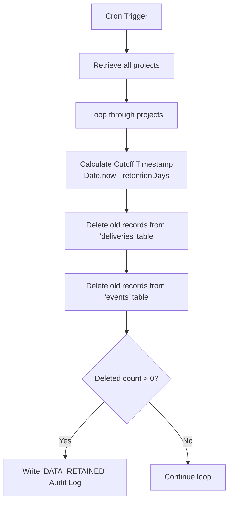

# Data Retention Policy

To maintain a lightweight database, optimize index search speeds, and comply with storage limitations, WebHook Hub enforces an automated data retention cleanup policy on events and delivery logs.

---

## Storage Constraints & The 7-Day Cap

Cloudflare D1 databases operating under the free tier have strict storage quotas (typically 500MB to 1GB). High-volume webhook pipelines can easily exceed this limit within a few weeks if logs are kept indefinitely.

* **Project Configuration**: The `projects` database table supports a `retention_days` column (which defaults to 30 days).
* **System Cap Enforcement**: To prevent storage exhaustion, the background scheduler job overrides project preferences and enforces a **hard cap of 7 days** for log retention:
  
$$\text{EffectiveRetentionDays} = \min(\text{project.retentionDays}, 7)$$

Any event or delivery log older than 7 days is permanently purged during the retention cycle.

---

## Retention Cleanup Process

The retention clean-up job (`runRetentionJob`) runs once per minute alongside the delivery job, scheduled via wrangler cron triggers:



### SQL Deletion Pattern
Because the `deliveries` table references `event_id`, old deliveries are deleted first using a subquery lookup on old events, followed by the deletion of the old events themselves:

```sql
-- 1. Delete deliveries associated with expired events
DELETE FROM deliveries 
WHERE event_id IN (
  SELECT id FROM events 
  WHERE project_id = ? AND created_at < ?
);

-- 2. Delete expired events
DELETE FROM events 
WHERE project_id = ? AND created_at < ?;
```

---

## Impact on Dashboard Views

Once logs are purged:
1. **Event Details**: The event payloads and delivery HTTP response histories for those events are no longer searchable or viewable in the developer dashboard.
2. **Aggregated Metrics**: Dashboard charts and telemetry are calculated only over the remaining active window.
3. **Replays**: Events older than the retention cutoff cannot be replayed since they are removed from the database tables.

If you require long-term storage of webhook delivery histories for compliance or auditing, we recommend copying event payloads to a secondary cold-storage data lake (e.g., Cloudflare R2 object storage or an external data warehouse) at the receiver boundary.
