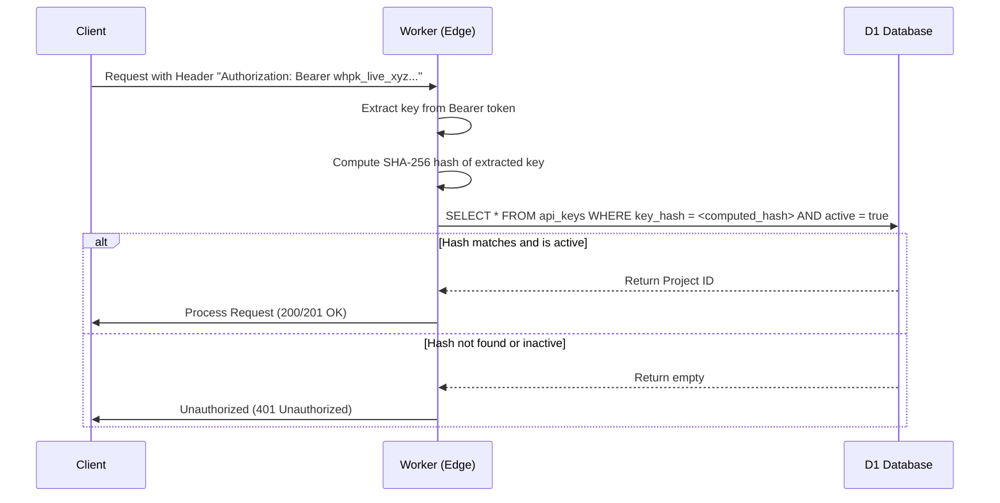

# API Key Authentication & Security Model

WebHook Hub uses API Keys to authenticate external publisher services publishing events to the platform. This document explains the structure, storage, lookup mechanism, and lifecycle management of these keys.

---

## Key Anatomy

All API keys generated by WebHook Hub are standard strings consisting of a prefix indicating environment scope followed by a cryptographically secure random value generated via `nanoid`.

* **Format**: `whpk_live_[A-Za-z0-9_-]{32}`
* **Example**: `whpk_live_k8S9d1jFmPz3vR2cW9xQ4yU6bN5mL8sJ`

The `whpk_live_` prefix acts as a secret scanner helper, allowing automated tools (like GitHub Advanced Security, TruffleHog, or GitGuardian) to easily scan code repositories and prevent accidental leakage of valid keys.

---

## Plaintext Storage Prevention (Zero-Plaintext Model)

To protect projects from database compromise or leaks, WebHook Hub **never stores plaintext API keys in the database**.

Instead, the database only stores a cryptographic hash of the key. If an attacker gains full read access to the database tables, they cannot decrypt the stored hashes back into valid API keys.

### Cryptographic Hashing Protocol
When a new API key is created:
1. The plaintext key (e.g., `whpk_live_abc123...`) is presented to the user **exactly once** in the response.
2. The key is put through a single round of SHA-256 hashing to generate a secure hex fingerprint:
   
$$\text{keyHash} = \text{SHA-256}(\text{plaintextKey})$$

3. The `keyHash` is saved in the `api_keys` database table under the `key_hash` column.
4. The plaintext key is discarded from server memory.

---

## Authentication Lookup Flow

When a publisher calls an authenticated endpoint (e.g., publishing an event via `POST /api/v1/events`), the platform worker processes the key in a resource-efficient manner:

Because the lookup query performs an exact-string match against the hashed column, index search operations in SQLite (D1) are fast ($O(1)$ index lookup).

---

## Key Lifecycle Management

### 1. Generation
API keys are generated programmatically on the edge using the native Web Crypto API to ensure high-entropy random sequence generation.

### 2. Status Flags
Each API key row includes an `active` boolean column:
* `active = true`: Key is active and authorized.
* `active = false`: Key is deactivated and all API requests using this key will immediately receive a `401 Unauthorized` status response.

### 3. Deactivation and Rotation
Rather than immediately deleting a key and causing breakages in downstream systems, administrators can rotate keys by:
1. Generating a new active API key.
2. Swapping the active keys in their configurations.
3. Marking the old API key as inactive (`active = false`).
4. Removing the old key entirely once traffic drops to zero.
