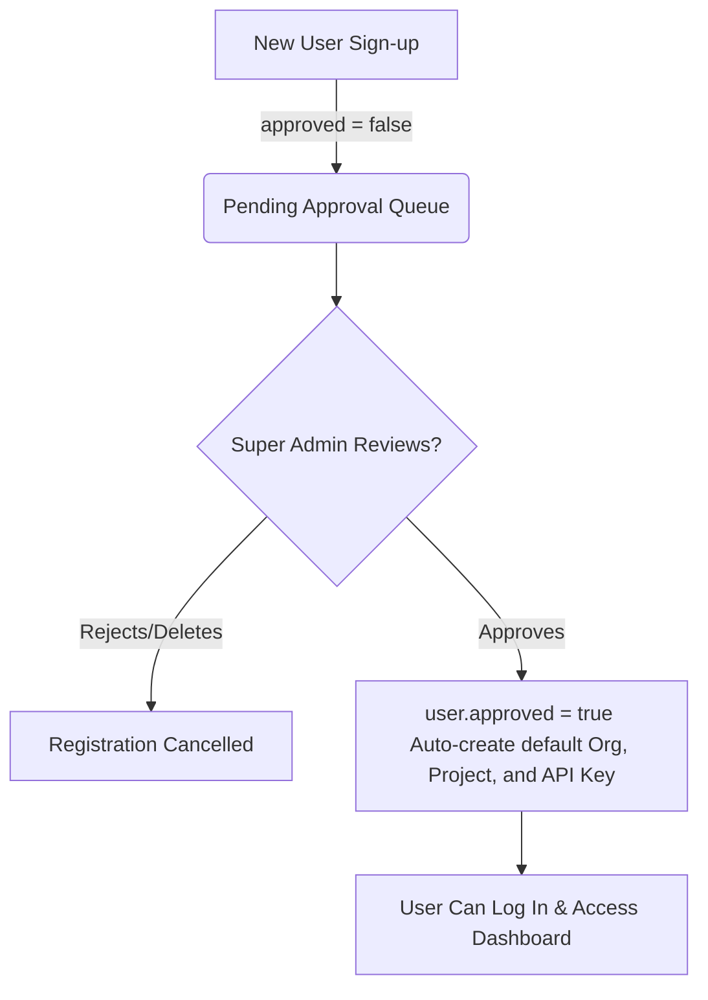

# Platform Security Model

WebHook Hub is designed with a defense-in-depth security model to protect system resources, user accounts, and customer webhook targets. Operating entirely within Cloudflare's serverless environment, the platform benefits from edge-native protections.

---

## 1. Network & Transport Security

* **HTTPS Enforcement**: All incoming client requests to the REST API, developer dashboard, and outbound webhook delivery requests are strictly served over HTTPS with TLS 1.2 or TLS 1.3.
* **CORS Policies**: Cross-Origin Resource Sharing (CORS) is configured on all API Worker route entries. Pre-flight `OPTIONS` requests only permit white-listed headers (like `content-type`, `x-webhook-signature`, `idempotency-key`) and restrict origin access to dashboard environments, preventing malicious browser-based CSRF attacks.

---

## 2. Access Control & Authorization

WebHook Hub uses a two-tier authentication architecture:

### A. API Key Authentication (Publisher Services)
* Authenticates requests publishing new events or querying webhook states programmatically.
* Keys are securely hashed using `SHA-256` before database entry.
* Authentication middleware rejects keys that are inactive or missing from the database.

### B. JWT Authentication (Dashboard Users)
* Dashboard users register with an email and password.
* Passwords are hashed using the high-entropy Web Crypto PBKDF2 algorithm (with a unique salt, 10,000 iterations, and SHA-256 hash).
* Upon login, a signed JSON Web Token (JWT) is issued. JWTs are signed with `HS256` using a server-side secret (`JWT_SECRET`) stored securely in Cloudflare Wrangler secrets.

---

## 3. Super Admin Gatekeeper Model

To prevent unauthorized resource consumption, automated spam, and potential exploitation, the platform enforces a **Super Admin Approval Workflow**:

1. **Default State**: New registrations are created in the `users` table with `approved = 0` (false) and the `user` role.
2. **Access Blocked**: If an unapproved user tries to log in, the backend returns a `403 Forbidden` error.
3. **Super Admin Review**: A user with the `super_admin` role can view pending approvals via `GET /api/v1/admin/pending`.
4. **Tenant Provisioning**: When the Super Admin approves the user (`POST /api/v1/admin/approve/:id`), the system updates the record to `approved = 1`, and automatically provisions a default Organization, a default Project, and a default API Key so the user can immediately use the platform upon their first login.

---

## 4. Multi-Tenant Data Isolation

To prevent Cross-Tenant Data Leakage (broken object-level authorization):
* All database queries for endpoints, events, metrics, and deliveries must strictly match the `projectId` associated with the authenticated context.
* The authentication middleware resolves the project context from either:
  1. The API Key's associated `projectId`.
  2. The authenticated user's organization memberships.
* Parameterized queries are enforced via Drizzle ORM, mitigating SQL injection risks.
