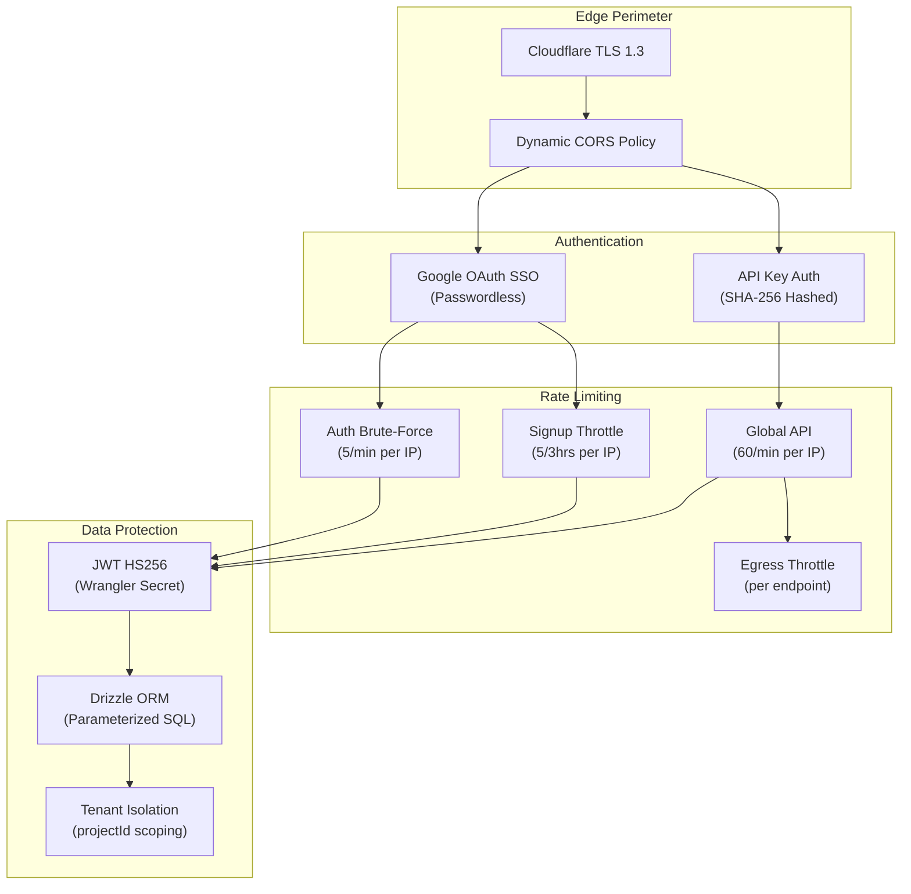
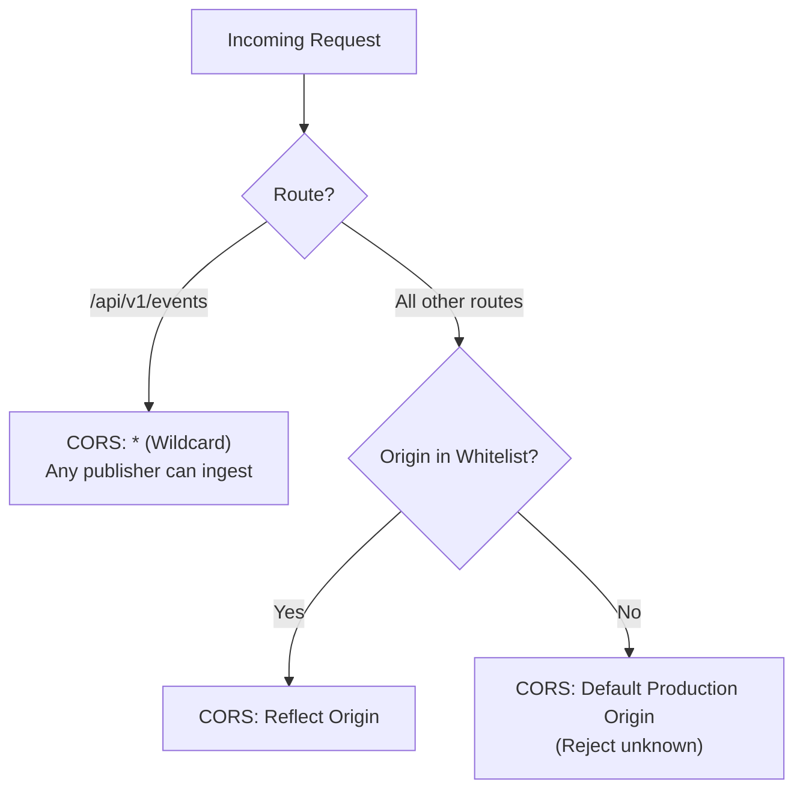
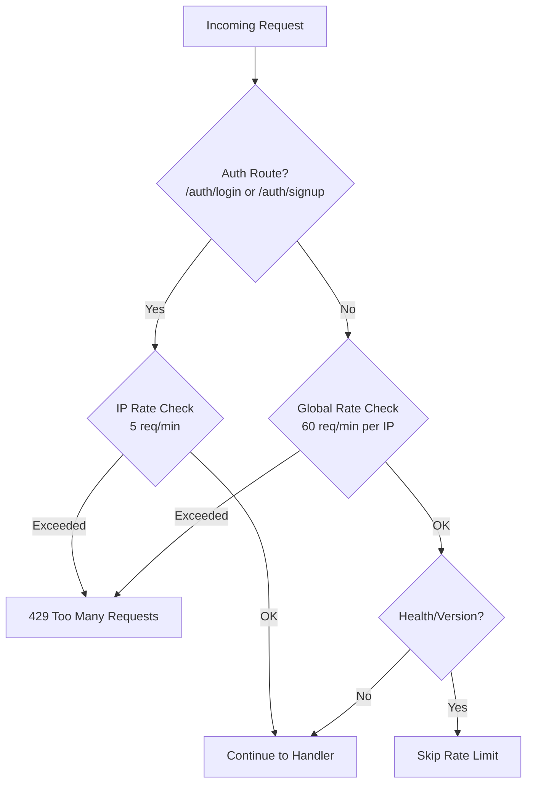
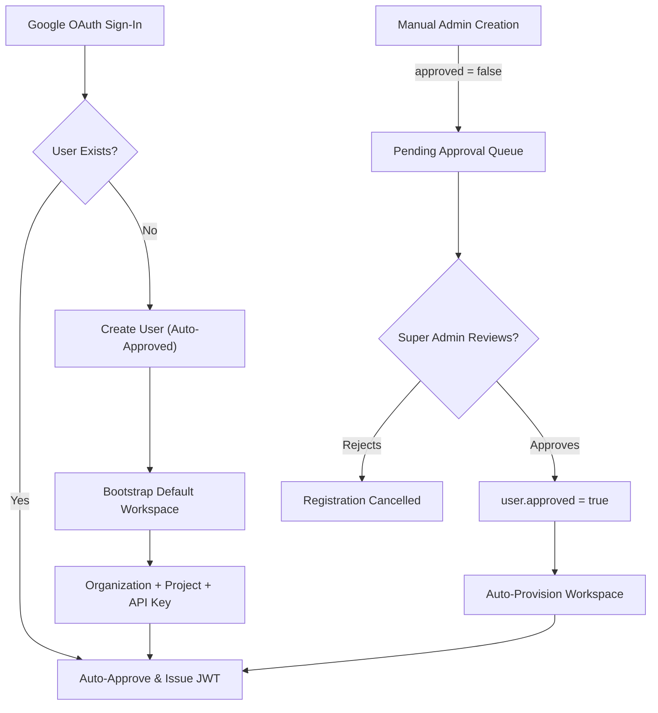

# Platform Security Model

WebHook Hub is designed with a defense-in-depth security model to protect system resources, user accounts, and customer webhook targets. Operating entirely within Cloudflare's serverless environment, the platform benefits from edge-native protections and eliminates traditional server-side attack vectors.

---

## Security Architecture Overview

---

## 1. Network & Transport Security

* **HTTPS Enforcement**: All incoming client requests to the REST API, developer dashboard, and outbound webhook delivery requests are strictly served over HTTPS with TLS 1.2 or TLS 1.3.
* **Dynamic CORS Policy**: Cross-Origin Resource Sharing (CORS) is enforced with a **dynamic origin whitelist** strategy:
  - **Public event ingestion** (`POST /api/v1/events`): Uses wildcard `*` origin to allow any publisher service to ingest events.
  - **Dashboard management APIs** (all other routes): Restricted to explicitly whitelisted origins:
    - `http://localhost:5173` (local development)
    - `https://webhook-platform.masir-projects.me` (production dashboard)
    - `*.webhook-platform.pages.dev` (Cloudflare Pages preview deployments)
  - All other origins are rejected, preventing browser-based CSRF and cross-origin attacks on management endpoints.

---

## 2. Access Control & Authorization

WebHook Hub uses a two-tier authentication architecture:

### A. API Key Authentication (Publisher Services)

* Authenticates requests publishing new events or querying webhook states programmatically.
* Keys are securely hashed using `SHA-256` before database entry.
* Authentication middleware rejects keys that are inactive or missing from the database.
* API Key lookups are cached in Cloudflare KV for low-latency ingestion.

### B. Google OAuth Authentication (Dashboard Users)

WebHook Hub exclusively uses **passwordless Google OAuth** for all dashboard user authentication. Traditional email/password signup and login have been fully removed.

* **No passwords stored**: Eliminates the risk of password hash leaks, brute-force password attacks, and credential stuffing.
* **Google token verification**: The API Worker verifies each Google ID token against Google's `oauth2.googleapis.com/tokeninfo` endpoint.
* **Audience validation**: The `aud` claim in the Google token is validated against the expected `GOOGLE_CLIENT_ID` to prevent token misuse.
* **Email verification**: Only Google accounts with verified emails (`email_verified: true`) are accepted.
* **JWT issuance**: Upon successful OAuth verification, a signed JWT (`HS256`) is issued. The `JWT_SECRET` is stored securely in Cloudflare Wrangler Secrets (never in source code or environment files).

---

## 3. Rate Limiting & Brute-Force Protection

WebHook Hub implements multi-layered IP-based rate limiting to prevent abuse:

| Limit | Key | Threshold | Window | Purpose |
| :--- | :--- | :--- | :--- | :--- |
| Auth brute-force | `auth:{clientIP}` | 5 requests | 60 seconds | Prevent credential stuffing on login/signup |
| Signup throttle | `signup:{clientIP}` | 5 accounts | 3 hours | Prevent mass account creation |
| Global API | `req:{clientIP}` | 60 requests | 60 seconds | General API abuse prevention |
| Egress throttle | `ratelimit:{endpointId}` | Configurable | 60 seconds | Protect downstream webhook receivers |

---

## 4. Super Admin Gatekeeper Model

To prevent unauthorized resource consumption, automated spam, and potential exploitation, the platform enforces a **Super Admin Approval Workflow** for manually-created users:

> **Note**: Users authenticating via Google OAuth are **auto-approved** on first sign-in. The manual approval queue is reserved for admin-created accounts.

---

## 5. Multi-Tenant Data Isolation

To prevent Cross-Tenant Data Leakage (broken object-level authorization):

* All database queries for endpoints, events, metrics, and deliveries must strictly match the `projectId` associated with the authenticated context.
* The authentication middleware resolves the project context from either:
  1. The API Key's associated `projectId`.
  2. The authenticated user's organization memberships.
* Parameterized queries are enforced via Drizzle ORM, mitigating SQL injection risks.

---

## 6. Webhook Payload Security

* **HMAC-SHA256 Signing**: Every outbound webhook payload is signed using the endpoint's secret key. The signature is computed over `${timestamp}.${eventId}.${payload}`.
* **Rolling Secrets**: Endpoints support `current` and `previous` secrets for zero-downtime rotations.
* **Replay Protection**: Signature timestamps are included to enable drift-window validation on the receiver side.
* **Idempotency Keys**: Publishers can send an `idempotency-key` header to prevent duplicate event ingestion.
